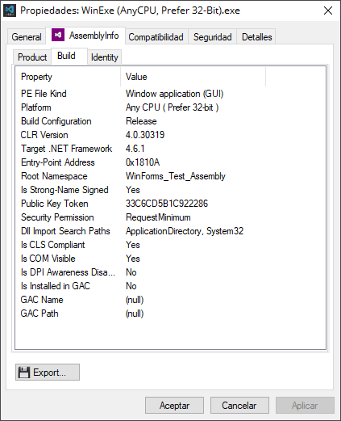
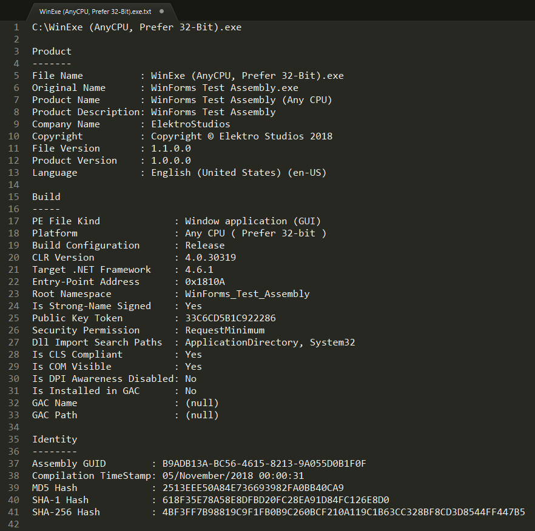

# .NET Assembly Info

.NET Assembly Info is a Windows property sheet shell-extension for .NET assemblies.

This shell-extension can help you to obtain basic information of any .NET assembly (.dll and .exe files) via the ***File -> Properties*** window dialog.

See screenshots below to know what information you can obtain. Future updates of this software will include more interesting things.

### Screenshots:

### Installation Requeriments:

- .NET Framework 4.7

### Third party libraries used to develop this project:

 - A partial, small, free sample of [ElektroKit Framework for .NET](https://codecanyon.net/item/elektrokit-class-library-for-net/19260282) source-code.
 
   ( If you would like to support me, buying my library would be great. )
 - [SharpShell](https://github.com/dwmkerr/sharpshell)
 - [System.Collections.Immutable](https://www.nuget.org/packages/System.Collections.Immutable/)
 - [System.Reflection.Metadata](https://www.nuget.org/packages/System.Reflection.Metadata/)
